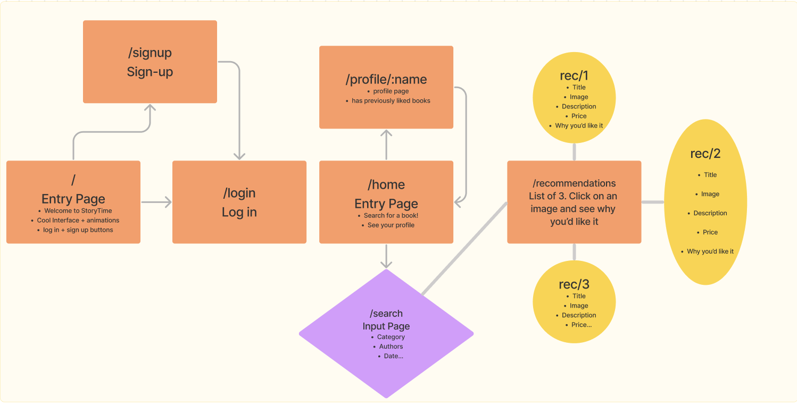
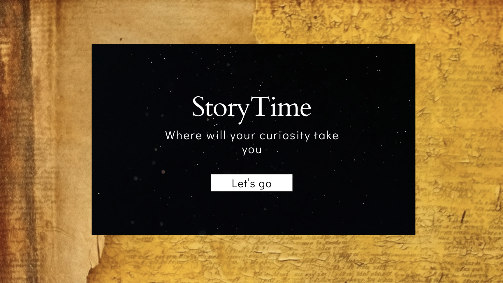
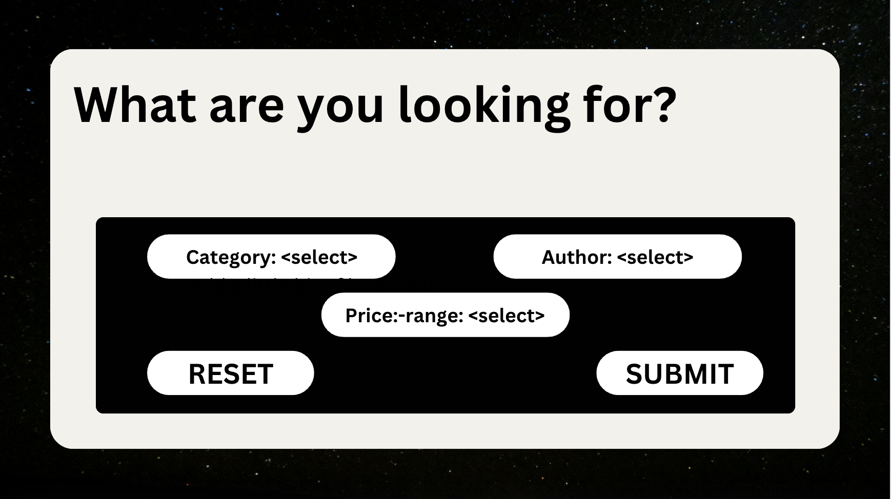
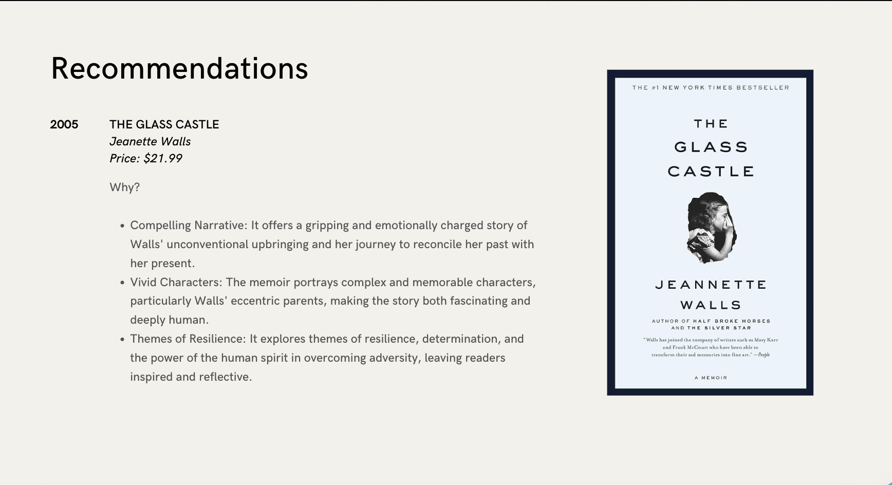
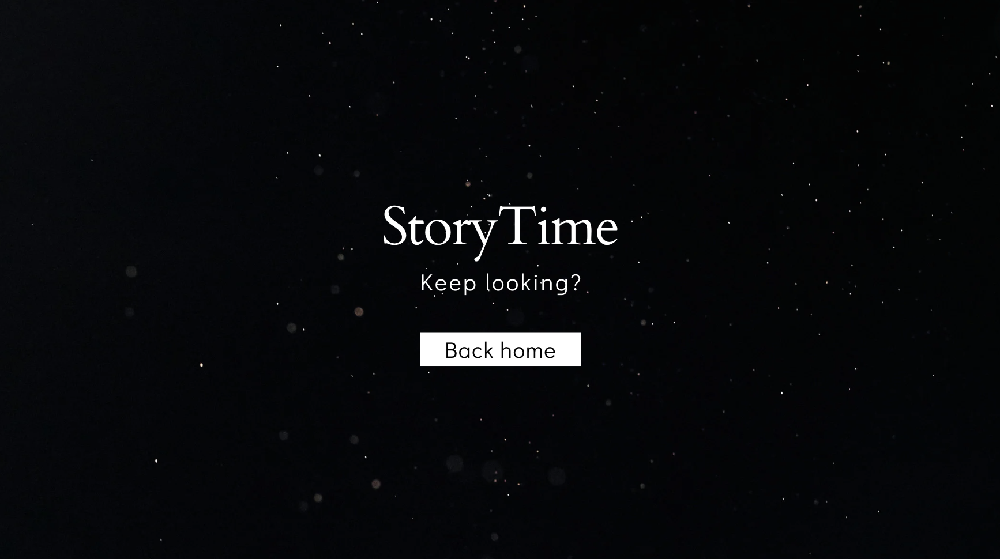
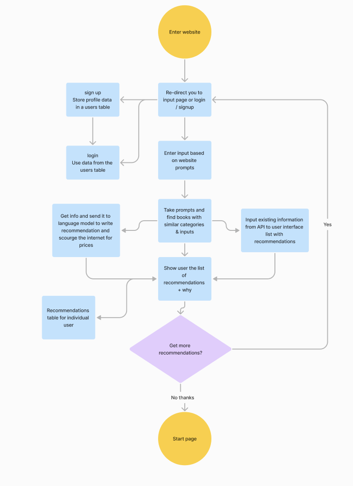

# Project Title

StoryTime

## Overview

My app will be a useful tool to help readers decide on their next book. What it will do is use existing information from famous book review sites to give helpful recommendations based on input provided by the user. It will use a language-learning model to provide descriptive feedback on what you'd like about each recommendation.

## How to deploy

Follow this links: [https://santiago-betancourth-capstone-nwsoartx7.vercel.app/](https://santiago-betancourth-capstone.vercel.app/)

### Problem

As a reader myself I've had many occasions where I go into a bookstore to find my next read but end up feeling overwhelmed by the sheer qauntity of books avaialable. I don't want to just pick a random book either. There's the possibilty it sucks and not only did I just spend over twenty dollars to buy it but now I'm stuck reading a book I don't like. My app would provide you with meaningful insights on each recommendation as well as what it thinks you'd be the most interested in.

### User Profile

It will be freely open to anyone who wants to use it. There will be no need to create an account. Users will be prompted with a series of questions on what type of book they are looking for. This information will then be used to give recommendations. Future functionality could be to create an account which will take into account your previous reads and recommend new ones it think you will like.

### Features

A feature which will take user input and use it to filter through a databsse of recommendations in order to give the best recommendations possible. It will provide descriptive feedback on the book and your potential price ranges. 

## Implementation

### Tech Stack

React.js, npm, node.js, express, CORS, axios, knex.js, JavaScript, SASS, react-router-dom, uuid, fs, dotenv
### APIs

New York Times API, ChatGPT (or other language models), potenitally other book review guides

### Sitemap

### Mockups

### Data

### Endpoints

GET request to New York Times API: https://api.nytimes.com
GET request to local database: http://localhost:8080

### Auth

For now there is no user auth / logins. The goal is to make this as widely accessible and easy-to-use as possible to encourage more frequent usage. One of my nice-to-haves would definitely include having a user login that tracks your reads & recommendations, but for now there won't be any login.

## Roadmap

SRINT 1: FRONT-END (2-3 days)
Complete all front-end aspects of the application. All forms, intro pages, formatting, research on topic, styling should be completed

SPRINT 2: BACK-END (3+ days)
Implementing dynamic aspects to the front-end as well as storing data in a database. Making all the necessary API calls as well as searching through documentation.

SPRINT 3: NICE-TO-HAVES (3 days)
Attempting all the diving deeper components of the app. Including the auth and the long-term recommendations.

## Nice-to-haves

Adding links to places where you can buy the books. Maybe sending you to other re-sellers online or directly to a store near you. If there is enough time to create user profiles then there could potentially be a feature where it tracks your reads and recommends you books based on genres and authors you've liked. This idea could take user input too: like a "like" & "dislike" button which rate the recommendations.
